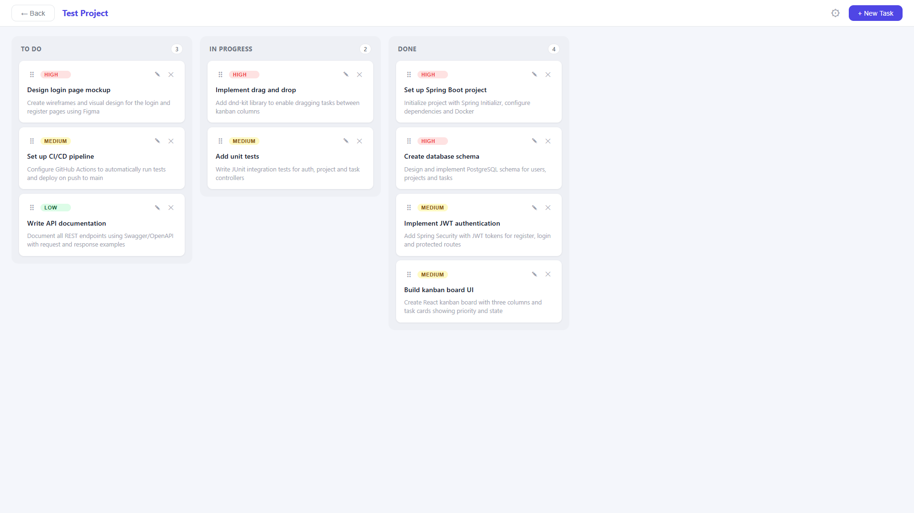

# Taskboard

A full-stack task management application built as a portfolio project.



## Features

- JWT authentication (register, login, profile management)
- Create and manage projects with team members
- Kanban board with drag & drop between columns
- Task management with priority levels, descriptions and due dates
- Real-time task state tracking (To Do, In Progress, Done)
- Responsive design for desktop and mobile

## Tech Stack

### Backend
- Java 25 + Spring Boot 4
- Spring Security + JWT
- Spring Data JPA + Hibernate
- PostgreSQL
- Docker + Docker Compose
- JUnit 5 integration tests

### Frontend
- React 19 + TypeScript
- Zustand (state management)
- React Query (server state)
- dnd-kit (drag & drop)
- Vite

## Getting Started

### Prerequisites
- Java 25
- Node.js 20+
- Docker Desktop

### Run locally

1. Clone the repository
```bash
   git clone https://github.com/yourusername/taskboard.git
   cd taskboard
```

2. Start the database
```bash
   cd backend
   docker compose up -d
```

3. Start the backend
```bash
   ./gradlew bootRun
```

4. Start the frontend
```bash
   cd ../frontend
   npm install
   npm run dev
```

5. Open `http://localhost:5173` in your browser

### Run tests
```bash
cd backend
./gradlew test
```

Test report available at `build/reports/tests/test/index.html`

## Project Structure
```
taskboard/
├── backend/
│   ├── src/
│   │   ├── main/java/
│   │   │   ├── user/          # Auth, register, login, profile
│   │   │   ├── project/       # Project CRUD, members
│   │   │   ├── task/          # Task CRUD, state, priority
│   │   │   ├── security/      # JWT filter, Spring Security config
│   │   │   └── exception/     # Global error handling
│   │   └── test/              # Integration tests
│   ├── docker-compose.yml
│   └── build.gradle
└── frontend/
└── src/
├── api/               # Axios + API functions
├── components/        # Reusable components
├── pages/             # Page components
├── store/             # Zustand auth store
└── types/             # TypeScript interfaces
```
## API Endpoints

### Auth
| Method | Endpoint | Description |
|--------|----------|-------------|
| POST | /api/auth/register | Register new user |
| POST | /api/auth/login | Login and get JWT token |
| GET | /api/auth/me | Get current user |
| PUT | /api/auth/me | Update profile |

### Projects
| Method | Endpoint | Description |
|--------|----------|-------------|
| GET | /api/projects | Get all projects for user |
| POST | /api/projects | Create project |
| PUT | /api/projects/:id | Update project |
| DELETE | /api/projects/:id | Delete project |
| POST | /api/projects/:id/members | Add member |

### Tasks
| Method | Endpoint | Description |
|--------|----------|-------------|
| GET | /api/projects/:id/tasks | Get tasks for project |
| POST | /api/projects/:id/tasks | Create task |
| PUT | /api/projects/:id/tasks/:id | Update task |
| DELETE | /api/projects/:id/tasks/:id | Delete task |
| PATCH | /api/projects/:id/tasks/:id/state | Update task state |
| PATCH | /api/projects/:id/tasks/:id/priority | Update task priority |